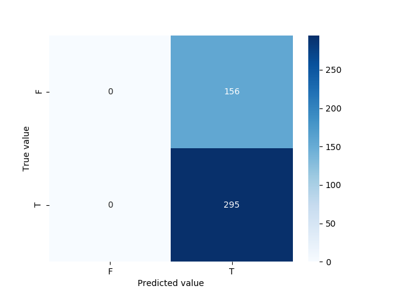

# Resultados obtenidos

## Ejercicio 1b
La matriz de confusión obtenida utilizando regresión logistica:

```bash
» go run ./cmd/ej1b\
	-test-file="datasets/acath2_test.csv"   \
	-train-file="datasets/acath2_train.csv" \
|python3 plotters/cf.py "" "results/ej1b.png"
```
```
Training:
        Model: Logistic (Binary) Classification
        Optimization Method: Batch Gradient Ascent
        Training Examples: 1807
        Features: 3
        Learning Rate α: 0.0001
        Regularization Parameter λ: 0
...

Training Completed.
h(θ,x) = 1 / (1 + exp(-θx))
θx = -29.972 + 3.97570(x[1]) + 0.50827(x[2]) + -0.81569(x[3])
```


## Ejercicio 1c
La probabilidad de que tenga estrechamiento arterial me dio 1:

```bash
» go run ./cmd/ej1c -train-file="datasets/acath2_train.csv"
```
```
Training:
        Model: Logistic (Binary) Classification
        Optimization Method: Batch Gradient Ascent
        Training Examples: 1807
        Features: 3
        Learning Rate α: 0.0001
        Regularization Parameter λ: 0
...

Training Completed.
h(θ,x) = 1 / (1 + exp(-θx))
θx = -29.972 + 3.97570(x[1]) + 0.50827(x[2]) + -0.81569(x[3])

Probability: 1.000000
```

## Ejercicio 1d
Al diferenciar mujeres y varones, mejora muchisimo la precision del modelo, como
se puede observar en la matriz de confusión:
```bash
» go run ./cmd/ej1d\
    -test-file="datasets/acath2_test.csv"   \
    -train-file="datasets/acath2_train.csv" \
|python3 plotters/cf.py "" "ej1d.png"
```
```
Training:
        Model: Logistic (Binary) Classification
        Optimization Method: Batch Gradient Ascent
        Training Examples: 1807
        Features: 4
        Learning Rate α: 0.0001
        Regularization Parameter λ: 0
...

Training Completed.
h(θ,x) = 1 / (1 + exp(-θx))
θx = -29.906 + -149.01573(x[1]) + 8.51273(x[2]) + 3.21275(x[3]) + 20.31228(x[4])
```


## Ejercicio 1e
Se puede observar que la precision del modelo mejora considerablemente en comparacion
con los resultados obtenidos con regresión logística. Y lo que es mejor aun en estas
predicciones, la cantidad de falsos negativos es la mitad:
```bash
» go run ./cmd/ej1e\
    -test-file="datasets/acath2_test.csv"   \
    -train-file="datasets/acath2_train.csv" \
|python3 plotters/cf.py "" "results/ej1e.png"
```

